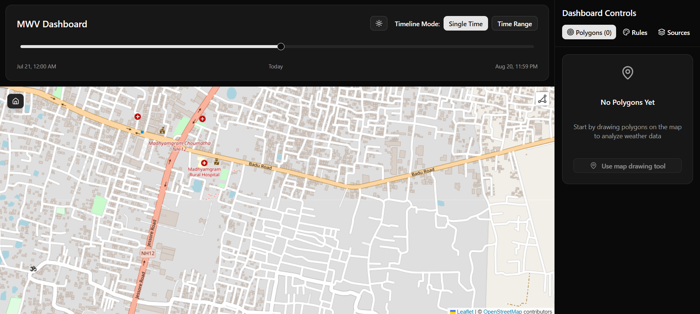
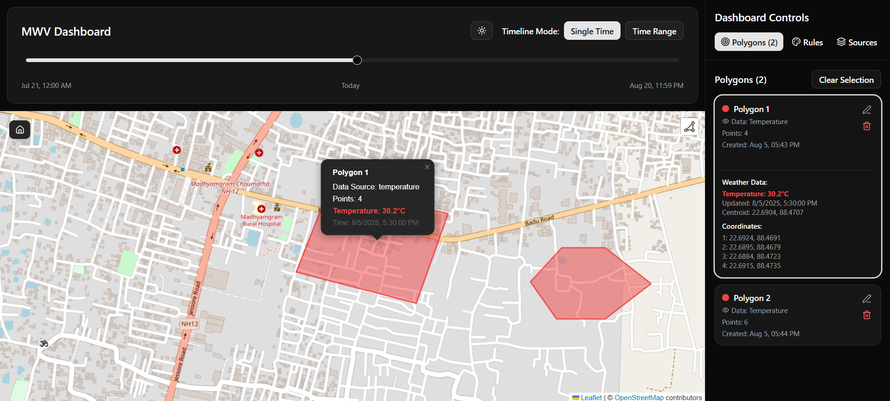
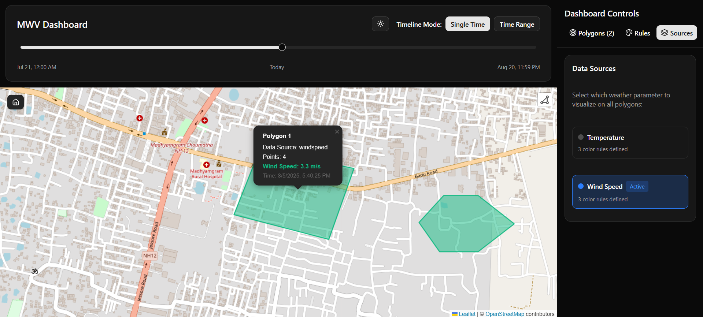
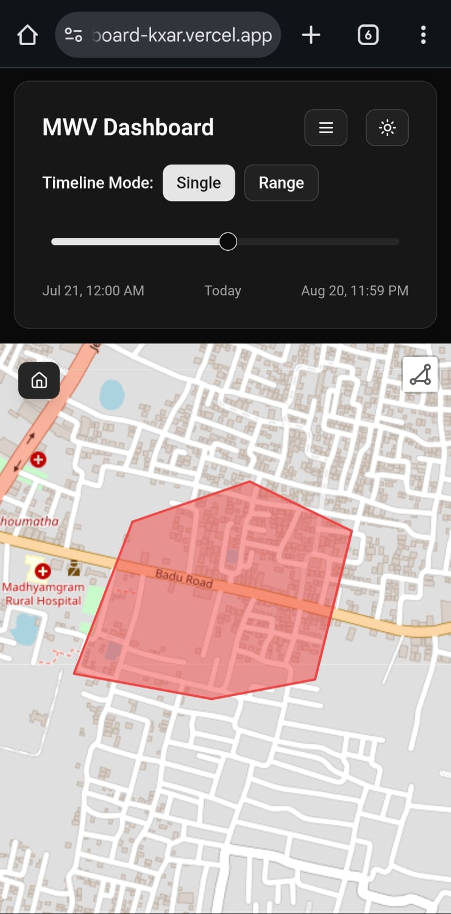
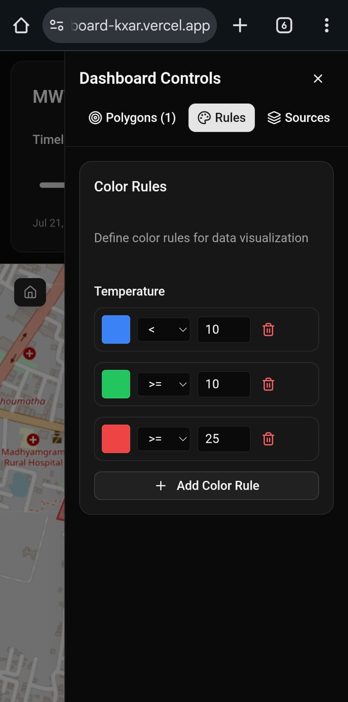

# MWV Weather Dashboard

A modern, interactive weather visualization dashboard for analyzing temperature and wind speed data across custom-drawn polygons. Built with Next.js, TypeScript, and Leaflet.

## 🌐 Live Demo

**[https://mwv-dashboard-kxar.vercel.app/](https://mwv-dashboard-kxar.vercel.app/)**

## Github Repository

**[https://github.com/neo-deus/mwv-dashboard](https://github.com/neo-deus/mwv-dashboard)**


## 📋 Features

- **Interactive Map**: Draw custom polygons on an OpenStreetMap interface
- **Dual Data Sources**: Toggle between Temperature and Wind Speed visualizations
- **Dynamic Color Coding**: Visual representation based on configurable rules
- **Timeline Control**: Navigate through hourly weather data with intuitive slider
- **Real-time Weather Data**: Powered by Open-Meteo API
- **Responsive Design**: Mobile-first approach with hamburger menu navigation
- **Dark Mode**: Complete theming system with localStorage persistence
- **Polygon Management**: Create, edit, rename, and delete weather analysis areas
- **Default Resolution**: Map loads at 2 sq km zoom level for optimal analysis

## 🚀 Setup and Run Instructions

### Prerequisites

- Node.js 18+
- npm, yarn, pnpm, or bun package manager

### Installation

1. **Clone the repository**

   ```bash
   git clone https://github.com/neo-deus/mwv-dashboard.git
   cd mwv-dashboard
   ```

2. **Install dependencies**

   ```bash
   npm install
   # or
   yarn install
   # or
   pnpm install
   # or
   bun install
   ```

3. **Run the development server**

   ```bash
   npm run dev
   # or
   yarn dev
   # or
   pnpm dev
   # or
   bun dev
   ```

4. **Open the application**

   Navigate to [http://localhost:3000](http://localhost:3000) in your browser

### Build for Production

```bash
npm run build
npm start
```

### Linting and Type Checking

```bash
npm run lint
npm run build  # Includes type checking
```

## 📚 Libraries and Technologies Used

### Core Framework

- **Next.js 15.4.5** - React framework with app router and server-side rendering
- **React 19** - UI library with modern hooks and concurrent features
- **TypeScript** - Type-safe development with strict configurations

### State Management

- **Zustand 5.0.2** - Lightweight state management with persistence middleware
- **@tanstack/react-query 5.62.2** - Server state management and caching

### Mapping and Visualization

- **Leaflet 1.9.4** - Interactive map library
- **React-Leaflet 4.2.1** - React components for Leaflet
- **Leaflet-Geoman 2.17.0** - Advanced polygon drawing and editing tools

### UI Components and Styling

- **Tailwind CSS 3.4.1** - Utility-first CSS framework
- **Radix UI** - Accessible, unstyled UI primitives
  - @radix-ui/react-slider - Timeline control component
  - @radix-ui/react-select - Dropdown selections
- **Lucide React 0.468.0** - Modern icon library
- **clsx & tailwind-merge** - Conditional CSS class utilities

### Weather Data

- **Open-Meteo API** - Free weather API providing temperature and wind speed data

### Development Tools

- **ESLint** - Code linting with Next.js configuration
- **PostCSS** - CSS processing and Tailwind integration

## 🏗️ Design and Development Remarks

### Architecture Decisions

1. **State Management Strategy**

   - Zustand chosen for its simplicity and TypeScript support
   - Persistence middleware ensures data survives page refreshes
   - Centralized store with clear action patterns

2. **Map Implementation**

   - Dynamic imports to avoid SSR issues with Leaflet
   - Dual polygon management: Geoman for creation, custom renderer for persistence
   - Efficient layer cleanup to prevent memory leaks

3. **Weather Data Flow**

   - Cached API responses with 30-minute staleness check
   - Batch processing for multiple polygons
   - Error handling with retry logic

4. **Component Architecture**
   - Modular design with clear separation of concerns
   - Custom hooks for complex state logic
   - Reusable UI components with Radix primitives

### Technical Highlights

- **Performance**: Optimized bundle with dynamic imports and code splitting
- **Accessibility**: ARIA-compliant components with keyboard navigation
- **Responsive**: Mobile-first design with progressive enhancement
- **Type Safety**: Comprehensive TypeScript coverage with strict mode
- **Error Boundaries**: Graceful degradation for API failures

### Development Challenges Solved

1. **SSR Compatibility**: Leaflet requires client-side only rendering
2. **Polygon Synchronization**: Managing both Geoman and custom layers
3. **Timeline Performance**: Efficient date calculations for large datasets
4. **Mobile Experience**: Responsive design with touch-friendly controls

## 📸 Screenshots


*Main dashboard with temperature visualization*


*Interactive polygon drawing interface*


*Toggle between temperature and wind speed data*

<p align="center">
  
  
</p>

*Responsive mobile interface*


## 🎯 Assignment Requirements Fulfilled

- ✅ Interactive map with polygon drawing capabilities
- ✅ Weather data integration with real-time API
- ✅ Dual data source support (Temperature & Wind Speed)
- ✅ Timeline control for temporal data navigation
- ✅ Dynamic color coding based on weather parameters
- ✅ Responsive design for multiple screen sizes
- ✅ Default 2 sq km resolution for optimal analysis
- ✅ Modern tech stack with TypeScript and Next.js

## 🚀 Deployment

The application is deployed on Vercel with automatic deployments from the main branch.

**Live URL**: [https://mwv-dashboard-kxar.vercel.app/](https://mwv-dashboard-kxar.vercel.app/)

---

_Built with ❤️ using Next.js and modern web technologies_
